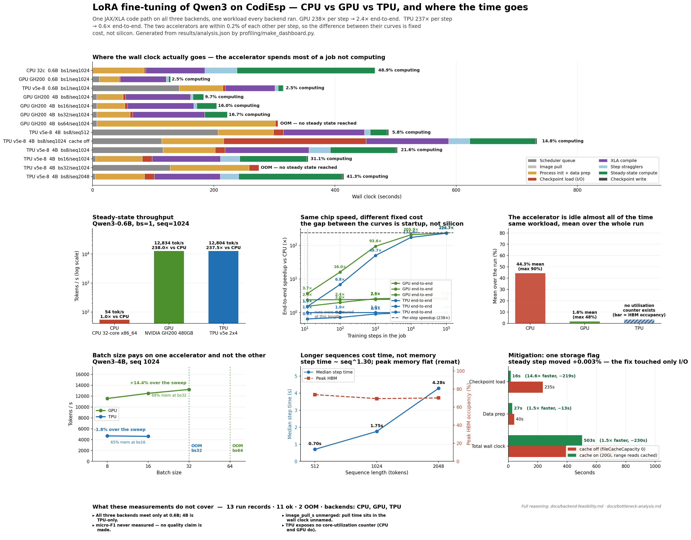

# Where does an LLM fine-tuning job actually spend its time?

**ME344 final project. Option 2, custom workload.**
LoRA fine-tuning of Qwen3 on CodiEsp (Spanish clinical case reports annotated with ICD-10
diagnosis codes), run through one JAX/XLA code path on CPU, GPU and TPU backends, instrumented
to answer one question:

> **Where does an LLM fine-tuning workload actually spend its time, and what does it take to
> run it at all?**

The second half of that question is not decoration. At **Qwen3-0.6B** all three backends run
and the comparison is clean. At **Qwen3-4B** the CPU does not run in any configuration we
tried. Growing the model by ~7× did not make the CPU ~7× slower. **It made the CPU
impossible**, and that discontinuity is the result a speedup chart would hide. It is reported
as a finding below, not as a missing row.

The workload is motivated by a medical billing system that processes clinical documentation.
That is the reason for choosing this dataset and nothing more: **this project makes no claim
about model quality, and none is measured.** The object of study is the infrastructure.

---

## Executive summary

We instrumented a 4-billion-parameter LoRA fine-tune end to end and split its wall clock into
eight segments that sum exactly to the total. Then we ran the same workload on all three
backends and swept batch size, sequence length and one storage flag.

**The headline is a gap between two numbers.** On the one configuration every backend could
run, both accelerators execute a training step about **238× faster** than the 32-core CPU node.
Measured end to end, at the length the jobs actually ran, the GPU is **3.68×** faster and the
TPU **1.51×**.

That gap is the finding. It is not measurement error, since every number comes from the same
three records. It is what happens when an accelerator makes the arithmetic so cheap that the
arithmetic stops being the job:

| Qwen3-0.6B, bs 1, seq 1024 | CPU 32-core | GPU GH200 | TPU v5e 2x4 |
|---|---|---|---|
| Per-step speedup vs CPU | 1.0× | **238.01×** | **237.45×** |
| Wall clock spent on steady-state compute | 48.9 % | **2.5 %** | **2.5 %** |
| Mean hardware utilisation over the run | 44.3 % | **1.6 %** | *no counter exists* |

**And the two accelerators make the case by themselves.** They execute this step within
**0.23 %** of each other, so their per-step performance is the same measurement twice. Their
end-to-end results are not: 3.68× against 1.51×. The entire difference is fixed cost: 125.7 s
against 307.1 s to stand the job up. Two accelerators with the same marginal cost and different
fixed costs is as close to a controlled experiment as this project gets, and it points at the
fixed cost rather than at the silicon.

The GPU row also settles the question directly, because `nvidia-smi` exposes what JAX does not:
**mean GPU utilisation over the whole run was 1.59 %**, with a peak of 48 %. The accelerator is
not working hard and slowly. It is idle.

Everything that is not compute is a scheduler queue, process startup, checkpoint I/O and, the
largest single controllable piece, XLA compilation, which on our reference 4B run costs
**138.5 s against 108.6 s of actual training**.

**What we changed.** One gcsfuse flag (`fileCacheCapacity: 0 → 20Gi` with
`fileCacheForRangeRead: true`) cut checkpoint load **14.57×**, from 235.1 s to 16.1 s, and took
**31.4 %** off total wall clock, while moving steady-state step time by **+0.003 %**, which is
how we know it touched only what it was aimed at.

**What we would change next**, with the prize already measured: turn on the persistent XLA
compilation cache. It targets 26–32 % of wall clock on every job.

**A note on how the GPU row was nearly lost.** It was blocked for a long time by a 403 between
an on-premises cluster and a Google-hosted registry, and by an `aarch64` dependency wall. The
dependency wall turned out to be one line: exactly **one of `google-tunix`'s 36 declared
requirements is TPU-bound** (`jax[tpu]`), and substituting `jax[cuda12]` is the entire port.
The registry wall turned out not to exist: the earlier conclusion came from probing the network
**from the node rather than from inside the cluster**, and a 30-second probe Job showed the pod
had full egress all along. One unchecked inference nearly closed a row that was open the whole
time. The chain is in [`docs/backend-feasibility.md`](docs/backend-feasibility.md).



*All figures generated by `profiling/make_dashboard.py` from `results/analysis.json`, which is
generated by `profiling/analyze.py` from the run records in `results/`. No number in this
report is typed by hand.*

---

## Tooling matrix

The brief asks for at least three elements of the AI infrastructure stack. All four
categories are exercised, and each one earned its place by changing a measurement.

| Category | What we used | Where it shows up in the results |
|---|---|---|
| **Compute targets** | 32-core x86_64 CPU · NVIDIA GH200 480 GB · TPU v5e 2×4 (8 chips) | The three-way comparison; the CPU is also the row that proves a 4B fine-tune does not fit in 31 GiB |
| **Orchestration** | Docker (3 pinned images) · Kubernetes Jobs on two clusters · Kueue admission · ConfigMap-mounted source | `submit_to_running_s` is a measured phase, not an estimate: 114–167 s of Kueue admission plus node boot plus image pull |
| **Compilation layer** | JAX / XLA, one program lowered to CPU, CUDA and TPU · LoRA via qwix · Tunix trainer | `compile_s` is its own phase. XLA compiles the same graph in 70.7 s on TPU and refuses to finish in 64 min on CPU |
| **Telemetry** | `src/telemetry.py` against a fixed schema · `nvidia-smi` sampling · `jax.local_devices().memory_stats()` · `psutil` | Every figure in this report; the schema's `notes` field is what caught a physically impossible measurement before it reached a chart |

Weights & Biases is wired into the training script and gated on `WANDB_API_KEY`
(`optional: true` in the manifests), so it starts without the secret and skips logging.
It was left off deliberately: the phase decomposition this project needs is finer-grained
than a W&B step curve, and adding a second source of truth would have invited the two to
disagree.

---

## System Topology Diagram

Three planes, one code path, and one authorization boundary that removed a column from the
results table. Full detail with every resource name in [`docs/topology.md`](docs/topology.md).

```
                    GCP project  soe-hpccenter                      Stanford on-prem
    ┌───────────────────────────────────────────────────────┐   ┌──────────────────────────┐
    │  Artifact Registry (us-central1)                      │   │  stanford-pilot          │
    │  us-central1-docker.pkg.dev/soe-hpccenter/tpu-images   │   │  ns  ns-student39        │
    │    ├── qwen3-codiesp-tpu-team-lharnold  linux/amd64    │   │                          │
    │    ├── qwen3-codiesp-cpu-team-lharnold  linux/amd64    │   │  hpcc-pilot  arm64       │
    │    └── qwen3-codiesp-gpu-team-lharnold  linux/arm64  ──┼─✗─┼─► GH200 480GB            │
    │                          │            403: no trust    │   │      ▲                   │
    │                          │ image pull  path between    │   │      │ public base image │
    │                          ▼             the two domains │   │      │ + src ConfigMap   │
    │  GKE  class-tpu-cluster-west4   (us-west4)             │   │      │ + PyPI/HF/Zenodo  │
    │  namespace: default  ← shared by the whole class       │   │      └── the route that  │
    │  admission: Kueue LocalQueue "student-queue"           │   │          worked          │
    │                                                       │   └──────────────────────────┘
    │                                                       │
    │   ┌─────────────────────────────────────────────┐     │
    │   │ Job qwen3-tpu-team-lharnold                 │     │
    │   │   nodeSelector gke-tpu-accelerator:         │     │
    │   │                  tpu-v5-lite-podslice       │     │
    │   │                gke-tpu-topology: 2x4        │     │
    │   │   limits  google.com/tpu: 8                 │     │
    │   │   serviceAccountName: jax-sa (Workload Id.) │     │
    │   │                                             │     │
    │   │   ┌──────────────┐   ┌────────────────────┐ │     │
    │   │   │ training     │◄──┤ gcsfuse sidecar    │ │     │
    │   │   │ container    │   │ fileCacheCapacity  │ │     │
    │   │   └──────────────┘   └─────────┬──────────┘ │     │
    │   │         mount /gcs              │           │     │
    │   └─────────────────────────────────┼───────────┘     │
    │        gcsfuse.csi.storage.gke.io   ▼                 │
    │   Cloud Storage  gs://me344-tpu-labs-west4            │
    │     teams/team-lharnold/models/{Qwen3-4B, Qwen3-0.6B} │
    │     teams/team-lharnold/data/codiesp                  │
    │     teams/team-lharnold/{ckpt,adapters,results}/…     │
    └───────────────────────────────────────────────────────┘

    ┌───────────────────────────────────────────────────────┐
    │  hpcc-cluster-39   2x Xeon E5-2670, 32 logical CPUs,  │
    │                    31 GiB DRAM, no Kubernetes         │
    │  podman run --cpus=32 --memory=28g --memory-swap=28g  │
    │    /model, /data ← local disk (read-only)             │
    │  no scheduler queue · no registry pull · no GCS       │
    └───────────────────────────────────────────────────────┘
```

Three topology facts shape every table below, and none of them is about a chip:

- **The CPU plane has no scheduler and no network storage.** Its `submit_to_running_s` and
  `image_pull_s` are `0.0`, measured rather than missing. End-to-end comparisons therefore charge
  the accelerators for a queue the CPU never enters, so `analysis.json` also carries every
  figure with the queue removed.
- **The TPU namespace is shared by the whole class.** That is the mechanism behind the most
  variable number in the dataset: queue time ranges 4 s to 207 s, a spread of **51.8×**. The
  GPU cluster gives each student a real namespace and its run queued for 11 s.
- **The three planes do not share a storage architecture.** The TPU reads model and corpus
  through a gcsfuse FUSE mount over Cloud Storage; the GPU job carries them inside its image
  and pulls dependencies from PyPI/Hugging Face/Zenodo; the CPU reads local disk. Data prep
  costs 30.57 s, 2.09 s and 2.62 s respectively: the same code, three storage paths. Any
  cross-backend wall-clock comparison is partly a comparison of these three paths, which is
  why the report attributes the difference rather than reporting it as a chip result.

---

## Performance Delta Analysis

### The one like-for-like comparison

Qwen3-0.6B, batch 1, sequence 1024, `bfloat16`, `remat=DECODER`. Identical script, identical
flags, one code path lowered by XLA to three backends.

| | CPU 32-core x86_64 | GPU GH200 (1 chip) | TPU v5e 2x4 (8 chips) |
|---|---|---|---|
| Median step time | 18.9899 s | **0.07979 s** | 0.07997 s |
| Throughput | 53.92 tok/s | 12 834.27 tok/s | 12 804.19 tok/s |
| Speedup vs CPU | 1.0× | **238.01×** | **237.45×** |
| Peak memory | 22.09 GB (66.1 % of 31 GiB) | 5.15 GB (**5.0 %** of 102.6 GB) | 1.23 GB (**7.3 %** of HBM) |
| Mean utilisation | 44.3 % host CPU | **1.59 %** (max 48 %) | *no counter exists* |
| Wall clock on compute | 48.9 % | 2.5 % | 2.5 % |
| Compile time † | 97.6 s | 76.0 s | 81.6 s |
| Fixed cost per job | 238.1 s | **125.7 s** | 307.1 s |
| Total wall clock | 466.0 s (12 steps) | 128.9 s (40 steps) | 315.1 s (100 steps) |

† **Compile time here is not `phases.compile_s` from the records** (116.6 / 40.2 / 42.2 s). Those
values omit the *second* compilation: the contract defines `steady_state_s` as `sum(steps[1:])`,
and `steps[1]` is itself an XLA compile on every accelerator record, costing 13×–496× the
median step. `profiling/analyze.py` re-partitions, so the row above is compile excess plus
recompile excess. Both quantities are kept side by side in `results/analysis.json` under
`phases_contract.compile_s` and `breakdown.segments.compile_s`; neither replaces the other.

**One GH200 matches an eight-chip v5e slice to within 0.23 %**, at 5.0 % memory occupancy
against the TPU's 7.3 %. At batch 1 this workload occupies neither accelerator: it is
latency-bound, and the v5e's eight chips buy nothing a single Hopper does not already deliver.
The TPU's advantage in this project lies elsewhere: it is the only platform here that still
runs when the model grows to 4B.

Both accelerator figures are **conservative** for the same reason: they were obtained from
hardware that was barely loaded.

A note on utilisation, because the three columns are not the same instrument. The CPU figure is
`psutil` host-CPU percent and the GPU figure is `nvidia-smi --query-gpu=utilization.gpu`; those
two are duty-cycle counters and are comparable. `utilization.mean_pct` is null on every TPU
record by design, because JAX exposes device memory statistics but no core-utilization counter,
and we did not invent one. The TPU rows carry HBM occupancy instead, which is a different
quantity and is reported under its own name rather than in this row.

**No scaling efficiency is quoted.** Speedup-per-chip would be 29.7× for the TPU and 238.0× for
the single-chip GPU, but that divides a cross-architecture ratio by a chip count and is not a
parallel efficiency. A real strong-scaling number needs a single-chip run of the same
accelerator, which we do not have for the TPU; `analysis.json` records
`strong_scaling_efficiency: null` with that reason attached rather than dressing up the
arithmetic. What the GPU row *does* license is narrower and more useful: at this configuration
the eight-chip slice delivers what one chip of another architecture delivers, which is a
statement about occupancy at batch 1, not about the v5e.

### The delta that is not a ratio: what it takes to run at all

Every number above is from Qwen3-0.6B, because that is the only size at which all three
backends produce a record. Scaling to Qwen3-4B, a ~6.7× parameter increase, does not produce
a larger ratio. It removes the CPU from the table:

| Qwen3-4B, bs 1, seq 1024, on the 32-core / 31 GiB node | Outcome |
|---|---|
| with `remat=DECODER` | XLA's CPU compiler **did not finish in > 64 min** (~166 % CPU on 32 cores: its compilation is substantially single-threaded, so the cores do not help) |
| without remat | **OOM-killed at 31.5 GB** anonymous RSS against 31 GiB of host RAM |
| without remat, seq 512 | 31.2 GB RSS, 0 GB free, the same trajectory |

Halving the sequence does not help because activations were never the binding term: JAX's CPU
backend materialises parameters in fp32 regardless of the `bfloat16` request, so the model
alone is ~16 GB before a single activation exists.

**This is a capacity result, not a missing measurement.** At 0.6B the accelerators are ~238×
faster; at 4B the ratio is undefined, because the denominator does not exist. The same
7× step that a scaling chart would draw as a line is, on this hardware, a wall. It is also the
answer to what the TPU is actually for in this project: at batch 1 an eight-chip v5e slice and
a single GH200 are the same machine to within 0.23 %, but the v5e is the only platform here
that still runs when the model grows. Full evidence, including the kernel's own OOM message,
is in [`docs/backend-feasibility.md`](docs/backend-feasibility.md).

### The delta that a user would actually feel

`time(N) = fixed_s + N · median_step_s`, both terms measured:

| Run length | CPU | GPU | TPU | GPU speedup | TPU speedup |
|---|---|---|---|---|---|
| 12 steps | 466.0 s | 126.7 s | 308.0 s | **3.68×** | **1.51×** |
| 100 steps | 2 137.1 s | 133.7 s | 315.1 s | 15.99× | 6.78× |
| 1 000 steps | 5 h 20 m | 3 m 26 s | 6 m 27 s | 93.57× | 49.68× |
| 10 000 steps | 52 h 49 m | 15 m 24 s | 18 m 27 s | 205.87× | 171.79× |
| ∞ | n/a | n/a | n/a | 238.01× | 237.45× |

Fixed cost is 238.1 s on CPU, **125.7 s on GPU** and **307.1 s on TPU**. The TPU breaks even
against the CPU at **N = 3.6 steps**; the GPU's fixed cost is already below the CPU's, so it
wins at every run length and its break-even is not a threshold at all.

**Read the two accelerator columns against each other.** Their asymptotes differ by 0.23 % and
their 12-step results differ by 2.4×. Where the 181 s of fixed-cost difference comes from is
measurable, and it is not the chip:

| | GPU | TPU | Note |
|---|---|---|---|
| Scheduler queue | 11 s | 143 s | TPU queue ranges 4–207 s across runs; this draw was unlucky |
| Data prep (inside `other_s`) | 2.09 s | 30.57 s | the GPU job reads a corpus baked into its image; the TPU reads through gcsfuse |
| Checkpoint load | 1.7 s | 4.4 s | same reason |
| XLA compile | 76.0 s | 81.6 s | near-identical; the compiler costs what it costs |

So the honest attribution is that roughly two thirds of the GPU's advantage here is a shorter
queue on a less contended cluster, and most of the rest is storage architecture. Neither is a
property of Hopper versus TPU v5e. That is the same conclusion as the rest of this report,
arrived at from the opposite direction.

### Sweeps, and the failure boundary

Qwen3-4B on TPU v5e 2x4, sequence 1024 (batch sweep) / batch 8 (sequence sweep):

| Batch | Step time | Tokens/s | Peak HBM | Status |
|---|---|---|---|---|
| 8 | 1.7512 s | 4 677.9 | 69.4 % | ok |
| 16 | 3.5650 s | 4 595.8 | 65.5 % | ok |
| 32 | n/a | n/a | n/a | **OOM**, HLO temporaries 21.67 G > 15.75 G HBM |

| Sequence | Step time | Tokens/s | Peak HBM |
|---|---|---|---|
| 512 | 0.7024 s | 5 831.0 | 73.8 % |
| 1 024 | 1.7512 s | 4 677.9 | 69.4 % |
| 2 048 | 4.2760 s | 3 831.6 | 70.1 % |

Two results worth stating plainly:

- **Batch size buys nothing.** Doubling batch multiplies step time by 2.036 and changes
  throughput by **−1.8 %**. The HBM ceiling at batch 32 therefore forbids a configuration that
  was not worth having.
- **Sequence length costs time, not memory.** Step time grows as `seq^1.30`; peak HBM is flat
  (73.8 / 69.4 / 70.1 %). That flatness is `remat=DECODER` bounding activation memory:
  rematerialisation converting a capacity problem into a time problem, visible in one row.

*Read against the corpus token-length distribution in
[`docs/dataset_stats.json`](docs/dataset_stats.json), those three windows cover **14.6 %**,
**72.8 %** and **99.2 %** of the training documents uncut. The 1 024 window benchmarked
throughout truncates 27.2 % of cases and loses the completion entirely on 21 % of them, so the
sweep above is also a coverage trade-off, not only a memory one.*

### Cost

Rates and sources are constants at the top of `profiling/analyze.py`, retrieved
2026-08-10. **Only one of the three applies to hardware that was actually billed:**

| | Rate | Applies to the measured hardware? |
|---|---|---|
| TPU v5e | $1.20 / chip-hour, us-west4 on-demand | **yes**, these runs really ran there |
| CPU | $1.1336 / hour, `n1-highcpu-32` | no, the node is Stanford on-prem with no list price |
| GPU | $2.29 / GPU-hour, GH200 market rate | no, on-prem, *and* GCP does not sell a GH200 |

| Configuration | $/1000 steps | $/M tokens (queue excluded) |
|---|---|---|
| CPU 32-core, Qwen3-0.6B | $6.05 *(proxy)* | $5.91 |
| GPU GH200, Qwen3-0.6B | **$0.13** *(proxy)* | **$0.12** |
| TPU v5e-8, Qwen3-0.6B | $1.03 | $0.64 |
| GPU GH200, 4B, bs 8 | **$0.56** *(proxy)* | **$0.07** |
| GPU GH200, 4B, bs 16 | $0.94 *(proxy)* | $0.06 |
| GPU GH200, 4B, bs 32 | $1.69 *(proxy)* | $0.05 |
| TPU v5e-8, 4B, bs 16 | $10.16 | $0.62 |
| TPU v5e-8, 4B, bs 8 | $5.72 | $0.66 |

The two 4B rows at batch 8 are the pair quoted on slide 5: **$0.56 against $5.72 per 1000
steps, a 10.3× gap**, at the one operating point where both accelerators were measured on the
same model, the same sequence length and the same batch. It is the like-for-like cost
comparison this project can actually support, and it is the one the deck states.

Three conclusions, each with the price sensitivity that supports it:

- The CPU costs **5.87×** the TPU and **46.32×** the GPU per 1000 steps at the same workload.
  Its proxy price would have to fall to $0.19/hour (TPU) or $0.02/hour (GPU) before either
  ordering reversed.
- **The single GPU is cheaper than the eight-chip TPU slice at this workload**, and since the
  two execute the step within 0.23 % of each other, that is purely a price comparison: one
  GH200 against eight v5e chips at $1.20 each. It holds across the **entire published GH200
  range ($1.99–$6.50/hour)**, so it does not depend on the quoted rate.
- Among the TPU configurations, larger batches are slightly cheaper per token ($0.62 at bs 16
  against $0.66 at bs 8) even though throughput falls. That is fixed-cost amortisation, not
  compute.

The inclusive `$/1000 steps` column contains whatever queue that run happened to draw, and
queue time varies 51.8×, so configurations are compared on the queue-excluded column, and
differences smaller than that spread are not differences.

---

## The Infrastructure Bottleneck Diagnosis

**This workload is fixed-cost bound. It is not compute bound, it is no longer I/O bound, and
it is not throughput-limited by memory.**

Every job pays a near-constant 240–460 s to stand itself up: scheduler queue, JAX
initialisation, data preparation, checkpoint load, and **two** XLA compilations. That cost
does not shrink when the accelerator gets faster. The largest controllable component is
compilation. On the reference 4B run the job spends **138.5 s compiling and 108.6 s training**:
more wall clock producing the program than running it.

The supporting numbers, for `tpu-v5e8-bs8-seq1024-filecache`, 502.8 s total:

| Segment | Seconds | % of wall clock |
|---|---|---|
| Scheduler queue | 116.0 | 23.1 % |
| Process init + data prep | 86.1 | 17.1 % |
| Checkpoint load (I/O) | 16.1 | 3.2 % |
| **XLA compile (two compilations)** | **138.5** | **27.6 %** |
| Step stragglers | 35.3 | 7.0 % |
| **Steady-state compute** | **108.6** | **21.6 %** |
| Checkpoint write | 2.1 | 0.4 % |

Compile time stays in a 76.0–138.5 s band across three architectures and configurations
differing by 6.7× in model size and 4× in sequence length, it is close to a constant. And the
two `bs8/seq1024` runs, which differ only by a storage flag that cannot change the graph,
compiled in 73.29 s and 70.72 s: a 3.6 % spread. **The same program is compiled from scratch
on every job.**

### The controlled comparison

The strongest evidence is not any single run but the pair of accelerators, because they hold
the marginal cost fixed and vary the fixed cost:

| | GPU GH200 | TPU v5e 2x4 |
|---|---|---|
| Median step time | 0.07979 s | 0.07997 s, **0.23 % apart** |
| Fixed cost per job | 125.7 s | 307.1 s, **2.44× apart** |
| End-to-end speedup at 12 steps | **3.68×** | **1.51×** |

Identical chip performance, different startup cost, different outcome. If the workload were
limited by anything the silicon does, these two rows would not separate. They separate by 2.4×.

### Why not the alternatives

| Candidate | Ruled out by |
|---|---|
| **Compute bound** | Steady-state compute is 21.6 % of the reference run and 2.5 % on *both* accelerators at the like-for-like configuration. All eight completed runs spend more wall clock not computing than computing. |
| **I/O bound** | It *was*: checkpoint load was 32.1 % of the uncached run and its largest segment. We removed it, 14.57× faster, and the job stayed **78.4 % non-compute**. The bottleneck moved to compilation rather than disappearing. That transition is what identifies the constraint. |
| **Memory bound** | Memory is a capacity limit, not a throughput limit. Batch 32 OOMs, but batch 16 is already **1.8 % slower** per token than batch 8, so the forbidden configuration was not worth having. Memory *is* decisive for feasibility: the 4B fine-tune does not fit the 31 GiB CPU node at all. |
| **Chip-level underutilisation** | **Now measured, on the one backend that exposes a counter: mean GPU utilisation over the whole run was 1.59 %** (max 48 %), from `nvidia-smi`. The accelerator is idle, not slow. This remains *not claimable for the TPU*, because JAX exposes no core-utilization counter and we did not fabricate one; its 7.3 % figure is HBM occupancy, which is a different quantity. |

Full derivation, including the exact identity used to split `steady_state_s` and the
sensitivity of each conclusion: [`docs/bottleneck-analysis.md`](docs/bottleneck-analysis.md).

---

## Engineering Mitigations

### Applied and re-measured

**gcsfuse file cache.** `fileCacheCapacity: "0" → "20Gi"`, plus `fileCacheForRangeRead: true`.
The second flag is not optional: `safetensors` reads the checkpoint through ranged reads, so
capacity alone would have appeared to do nothing.

| | Before | After | Delta |
|---|---|---|---|
| Checkpoint load | 235.09 s | 16.13 s | **14.57× faster, −219.0 s** |
| Data prep | 40.32 s | 27.29 s | 1.48× faster, −13.0 s |
| **Total wall clock** | **732.90 s** | **502.78 s** | **−31.4 %** |
| Steady-state step time | 1.75117 s | 1.75123 s | +0.003 % |

The last row is the control. A storage change that had also moved compute time would have
meant the two runs differed in something else; it moved by three thousandths of a percent, well
inside the p10–p90 band. **The fix moved exactly the phase it targeted.**

### Recommended, with the prize already measured

1. **Persistent XLA compilation cache.** `JAX_COMPILATION_CACHE_DIR` is already plumbed through
   the manifest and defaulted to empty in `manifests/env.sh`, deliberately, so `compile_s`
   would be visible during measurement rather than hidden. Turning it on targets **76.0–138.5 s
   per job, 26–32 % of wall clock**, and it is the one recommendation that applies to all three
   backends: the GPU pays 76.0 s for the same graph the TPU pays 81.6 s for. The evidence it
   will work is the 3.6 % spread between two identical compilations. This is recomputed work.

2. **Fewer, longer jobs.** The fixed cost is amortised only by run length: on the TPU 1.51× at
   12 steps, 6.78× at 100, 49.68× at 1 000. Our own benchmark runs sit in the worst part of
   that curve. A scheduling decision, not a code change.

3. **Move the data to the compute, or the cache to the data.** This is the recommendation the
   GPU row bought us. The same data-preparation code costs **30.57 s** reading through gcsfuse
   and **2.09 s** reading from inside the image, a 14.6× difference from storage architecture
   alone, and consistent with the 14.57× the file cache delivered on checkpoint load. For a
   corpus this small, baking it into the image is strictly better than mounting a bucket. For
   a corpus that does not fit an image, the file cache is the same fix by another route.

4. **Diagnose the second compilation.** Every accelerator record compiles twice, and
   `steps[1]` costs 13×–496× the median, roughly half the compile budget. That it appears on
   *both* the TPU and the GPU is new information: it is a property of the program, not of one
   backend. We can measure it but not explain it from these records; the cause needs an XLA
   trace we did not take. A diagnosis to run, not a fix we are claiming.

5. **Attribute the image pull.** `image_pull_s` is null on every accelerator record. It is
   measured by the launcher and never merged in with `telemetry.merge_external_phases()`, so
   real pull time is sitting inside the wall clock without a name. This is a gap in our own
   instrumentation and it is ours to close.

6. **Match the accelerator to the model, not to the benchmark.** At 0.6B and batch 1 the
   eight-chip v5e slice and the single GH200 are the same machine to within 0.23 %, and the
   GPU is cheaper. That is not an argument against the TPU. It is an argument against reading
   a batch-1 benchmark as a platform choice. The v5e is the only platform here that runs the
   4B model at all, which is the configuration a real workload would use.

### Considered and rejected on the evidence

- **Larger batches for throughput.** Measured at **−1.8 %** going from 8 to 16. Larger batches
  do slightly improve cost per token, but through fixed-cost amortisation, not compute.
- **Shorter sequences to save memory.** Peak HBM is flat across a 4× sequence range, because
  `remat=DECODER` already bounds activation memory. The same lever failed on the CPU node for
  the same reason: halving the sequence there still hit 31.2 GB RSS, because parameters, not
  activations, were the term that did not fit.
- **bf16.** Already applied throughout (`dtype: bfloat16`, with `dtype_fields_applied`
  recording that it reached both `dtype` and `param_dtype`). Worth noting that it does not
  transfer: JAX's CPU backend materialises parameters in fp32 regardless of the request, which
  is a large part of why the 4B model does not fit the CPU node.

---

## Known gaps

Generated from `coverage.gaps` in `results/analysis.json`, so this list cannot drift from what
the records support.

| Gap | Consequence | Where it is explained |
|---|---|---|
| All three backends meet only at Qwen3-0.6B | Cross-backend speedup is quoted at 0.6B only; the 4B rows are TPU-only and have no cross-backend ratio | [`docs/backend-feasibility.md`](docs/backend-feasibility.md): the 4B fine-tune exceeds 31 GiB on the CPU node in every configuration tried |
| `eval.micro_f1` null everywhere | **No model-quality figure is reported** | `src/evaluate.py` exists and was never run |
| `image_pull_s` null on accelerators | Registry pull time is inside the wall clock without a name | `telemetry.merge_external_phases()` was not run |
| No TPU utilization counter | Utilisation is comparable between CPU and GPU, but the TPU row is a different quantity | JAX exposes memory statistics, not core utilisation |
| ~~`docs/dataset_stats.json` absent~~, **closed** | The truncation table is now committed and the sequence sweep can be read against it | [`docs/dataset_stats.json`](docs/dataset_stats.json), regenerated from the corpus |

`docs/dataset_stats.json` was regenerated on a second machine after the cluster became
unreachable, which incidentally makes it a reproducibility check: the same `src/prepare_data.py`
against the same Zenodo archive produced byte-identical counts: 500 train / 250 dev documents,
p50 802 tokens, and the same truncation table to the decimal. It is the source for every
coverage figure quoted in [Sweeps](#sweeps-and-the-failure-boundary), and it is what licenses
the claim that **zero label loss needs `seq_len > 2291`**, well beyond any window benchmarked
here.

The single largest gap in an earlier draft of this report, no GPU record at all, is now
closed, and the way it closed is itself worth recording: the blocker was believed to be a
registry authorization boundary, and that belief came from probing the network **from the node
instead of from inside the cluster**. The pod had full egress the whole time. We are keeping
the failed reasoning in [`docs/backend-feasibility.md`](docs/backend-feasibility.md) rather
than quietly deleting it, because "the measurement that was nearly not taken, and why" belongs
in a systems report.

**On the honesty of the quality question.** This project reports no F1, because none was
measured. Even had `evaluate.py` been run, the number would have been a functional check and
not a quality claim: the run records imply a training split of **496–503 documents** (four runs
report their epoch wraparound, and `batches = n_docs // batch_size` bounds it) against an
ICD-10 label space several times larger, trained for 12–100 steps. That is a throughput budget,
not a convergence budget. The rubric awards nothing for model accuracy and we have measured nothing
that would deserve it.

---

## Reproducibility

```bash
git clone https://github.com/RN0L/me344-qwen3-icd10-scaling
cd me344-qwen3-icd10-scaling

# The analysis half needs no cluster access. Every measurement is committed as JSON.
python3 profiling/analyze.py --print      # stdlib only; writes results/analysis.json
python3 -m pip install matplotlib
python3 profiling/make_dashboard.py --panels   # writes results/systems_dashboard.png
```

`analyze.py --check` re-validates every record against
[`docs/metrics-contract.md`](docs/metrics-contract.md) before deriving anything: phases must
sum to `total_wall_s`, `status` must be in the enum, and `tokens_per_s` must equal
`batch_size × seq_len / median_step_s`. That last check exists because one earlier run reported
11 million tokens/s with `status: "ok"`. A per-step probe had blocked on a stale buffer, and the
run was caught only by reading its `notes`. **A passing status is not sufficient to trust a
record.**

So the analysis reads `notes` too, and does it **per field rather than per record**. Each
known phrase names the field it taints: a note about a stale buffer taints `steady`; the note
that no per-step loss could be captured taints `steps[].loss` and nothing else. A taint on a
field the deliverables actually plot is a **hard error that refuses to produce output**; a
taint on a field nothing plots is recorded as a warning and carried into `analysis.json`. All
nine records currently carry the loss caveat and none is thereby untrustworthy for step times,
which is precisely the distinction a whole-record verdict would lose.

One detail worth stating, because it is the kind of thing that makes a check useless without
anyone noticing: the phrase in the records is *"no per-step loss **could be captured**"*, not
*"could not be captured"*. A filter written from memory would have matched nothing and passed
every record silently. The patterns are matched against what the records say.

To reproduce the measurements themselves you need the class clusters:

```bash
source manifests/env.sh
me344_submit tpu && me344_wait tpu && me344_harvest tpu     # TPU
FILE_CACHE=20Gi FILE_CACHE_RANGE_READ=true me344_submit tpu # the mitigation re-measurement
bash manifests/cpu-run.sh                                   # CPU, bare metal via podman
bash scripts/sweep.sh                                       # batch and sequence sweeps
```

The GPU run uses `manifests/gpu-train-public.yaml`, which needs no registry credential and no
`imagePullSecret`: a public base image, the source tree mounted from a ConfigMap, and
dependencies pulled from PyPI, Hugging Face and Zenodo at start-up. That is why it works from a
cluster with no trust path to the class registry.

### Data, licences and privacy

- **Corpus:** [CodiEsp](https://temu.bsc.es/codiesp/), Spanish clinical case reports annotated
  with ICD-10 (task 1, `DIAGNOSTICO`), **CC-BY 4.0**, publicly downloadable. Prepared by
  `src/prepare_data.py`; the corpus itself is not committed (see `.gitignore`), only the
  measurements taken over it.
- **Model:** Qwen3-0.6B and Qwen3-4B, Apache-2.0.
- **No patient data of any kind was used.** CodiEsp is a public, published, de-identified
  research corpus.
- **No proprietary or customer data was used**, and none is present in this repository. The
  workload was chosen because a medical billing system that processes clinical documentation is
  a realistic setting for this class of fine-tune; no system, customer or internal detail from
  any such setting appears here.

### Repository map

| Path | What it is |
|---|---|
| `docs/metrics-contract.md` | The schema every run record satisfies. Read this first |
| `docs/topology.md` | Full topology, storage path, and where each timestamp was taken |
| `docs/bottleneck-analysis.md` | The derivation behind the diagnosis, and the alternatives it excludes |
| `docs/backend-feasibility.md` | What would not run, and why: the CPU capacity limit and the GPU chain |
| `results/*.json` | The measurements. Eight run records: 7 `ok`, 1 `oom` |
| `results/analysis.json` | Every derived number, generated |
| `profiling/analyze.py` | The only place derived quantities are computed |
| `profiling/make_dashboard.py` | The figure, generated from `analysis.json` |
| `slides/` | Five-slide deck |
| `src/`, `docker/`, `manifests/`, `scripts/` | Pipeline, images, manifests, orchestration |
